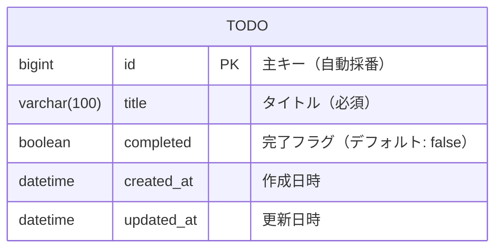

# データベース設計

[← 目次に戻る](./README.md)

## ER図



## テーブル定義

### todos テーブル

| カラム名 | 型 | 制約 | 説明 |
|---------|-----|------|------|
| id | BIGINT | PRIMARY KEY, AUTO_INCREMENT | 主キー |
| title | VARCHAR(100) | NOT NULL | タイトル |
| completed | BOOLEAN | NOT NULL, DEFAULT FALSE | 完了フラグ |
| created_at | DATETIME | NOT NULL | 作成日時 |
| updated_at | DATETIME | NOT NULL | 更新日時 |

## DDL

```sql
CREATE TABLE todos (
    id BIGINT AUTO_INCREMENT PRIMARY KEY,
    title VARCHAR(100) NOT NULL,
    completed BOOLEAN NOT NULL DEFAULT FALSE,
    created_at DATETIME NOT NULL,
    updated_at DATETIME NOT NULL
);
```
