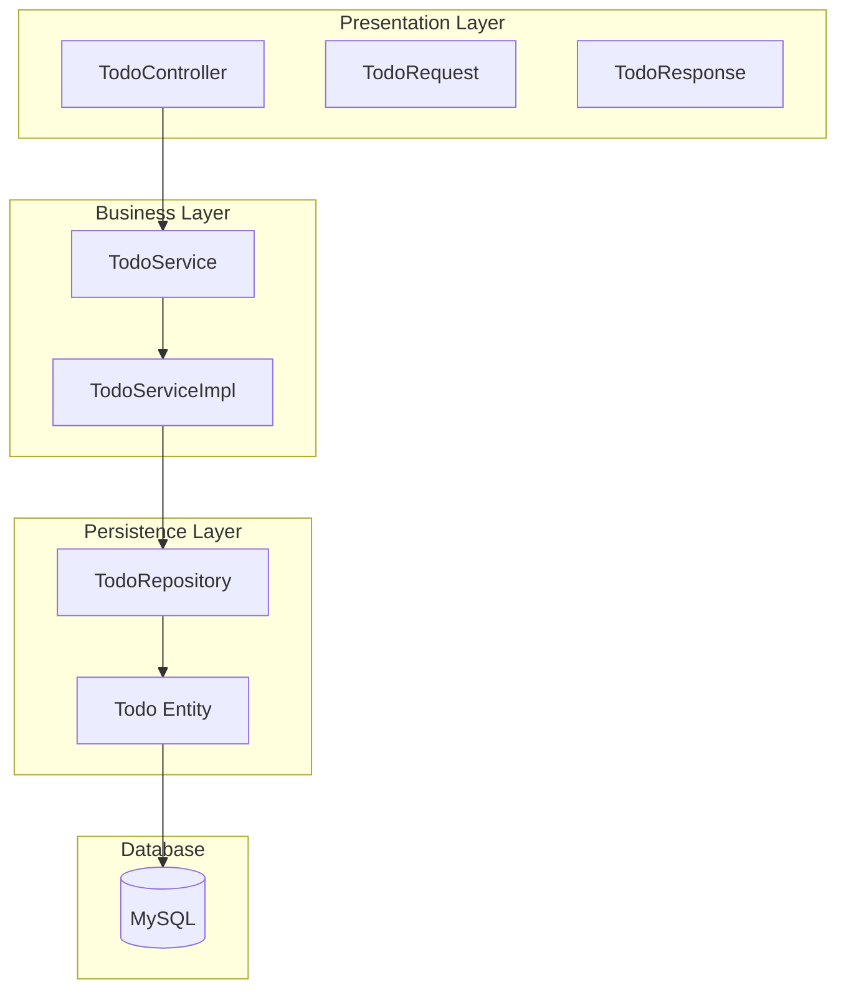
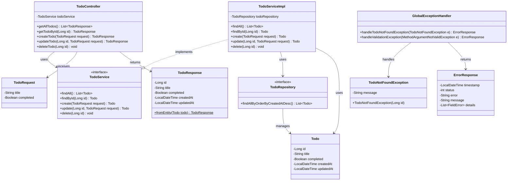

# アーキテクチャ

[← 目次に戻る](./README.md)

## レイヤー構成



---

## パッケージ構成

### バックエンド（Spring Boot）

```
todo-app-server/
├── build.gradle
├── settings.gradle
├── src/
│   ├── main/
│   │   ├── java/com/todoappserver/
│   │   │   ├── TodoAppServerApplication.java
│   │   │   ├── controller/
│   │   │   │   └── TodoController.java
│   │   │   ├── service/
│   │   │   │   ├── TodoService.java
│   │   │   │   └── impl/
│   │   │   │       └── TodoServiceImpl.java
│   │   │   ├── repository/
│   │   │   │   └── TodoRepository.java
│   │   │   ├── entity/
│   │   │   │   └── Todo.java
│   │   │   ├── dto/
│   │   │   │   ├── TodoRequest.java
│   │   │   │   └── TodoResponse.java
│   │   │   └── exception/
│   │   │       ├── GlobalExceptionHandler.java
│   │   │       ├── TodoNotFoundException.java
│   │   │       └── ErrorResponse.java
│   │   └── resources/
│   │       └── application.yml
│   └── test/
│       └── java/com/todoappserver/
│           ├── controller/
│           │   └── TodoControllerTest.java
│           └── service/
│               └── TodoServiceTest.java
└── Dockerfile
```

### フロントエンド（Next.js）

```
todo-app-client/
├── package.json
├── next.config.ts
├── tailwind.config.js
├── tsconfig.json
├── src/
│   ├── app/
│   │   ├── layout.tsx
│   │   ├── page.tsx
│   │   └── globals.css
│   ├── components/
│   │   ├── ui/                      # shadcn/ui コンポーネント
│   │   │   ├── button.tsx
│   │   │   ├── input.tsx
│   │   │   ├── checkbox.tsx
│   │   │   ├── card.tsx
│   │   │   ├── dialog.tsx
│   │   │   └── form.tsx
│   │   └── todo/
│   │       ├── TodoList.tsx
│   │       ├── TodoItem.tsx
│   │       ├── TodoForm.tsx
│   │       └── TodoEditDialog.tsx
│   ├── hooks/
│   │   └── useTodos.ts              # TanStack Query hooks
│   ├── lib/
│   │   ├── api.ts                   # axios インスタンス
│   │   └── utils.ts                 # shadcn/ui ユーティリティ
│   ├── schemas/
│   │   └── todo.ts                  # zod スキーマ
│   └── types/
│       └── todo.ts                  # 型定義
└── public/
```

---

## クラス図


