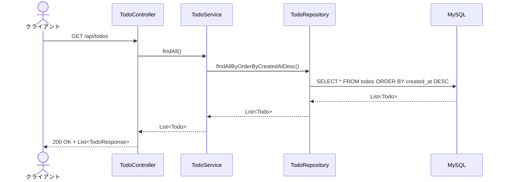
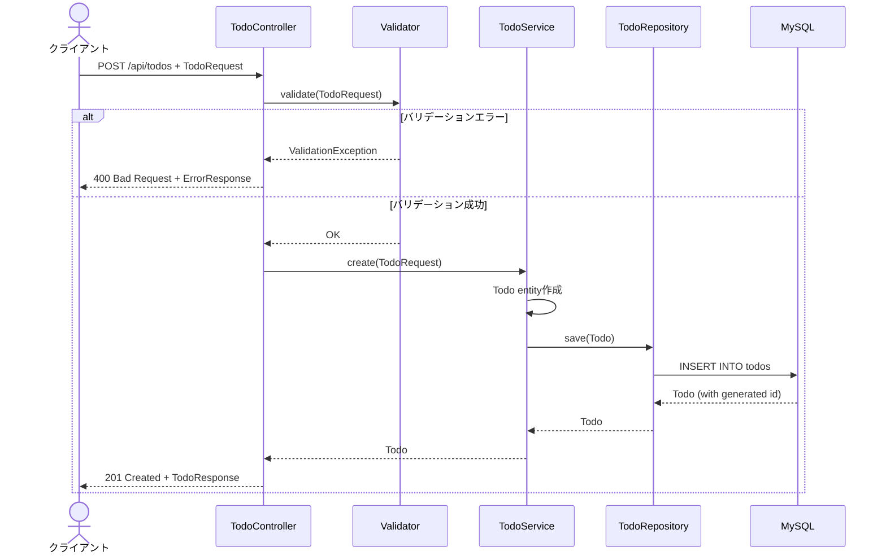
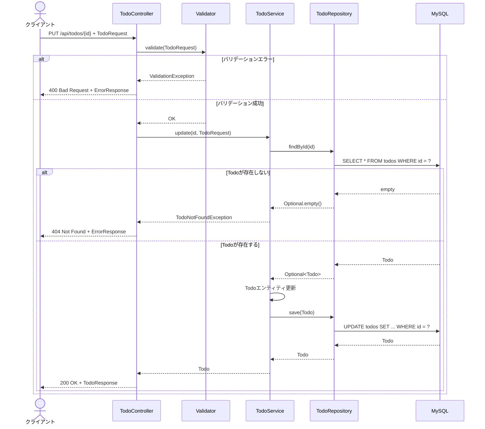
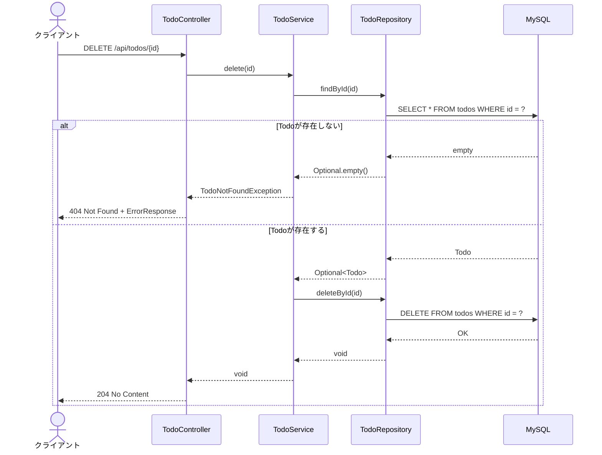
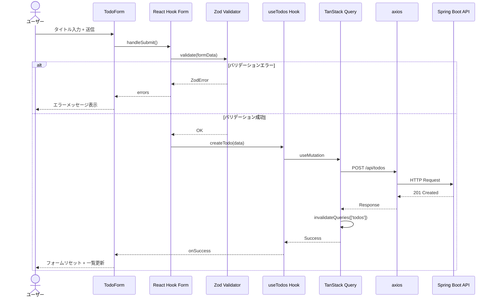

# シーケンス図

[← 目次に戻る](./README.md)

## Todo一覧取得（GET /api/todos）

---

## Todo新規作成（POST /api/todos）

---

## Todo更新（PUT /api/todos/{id}）

---

## Todo削除（DELETE /api/todos/{id}）

---

## フロントエンド フロー（Todo作成例）

