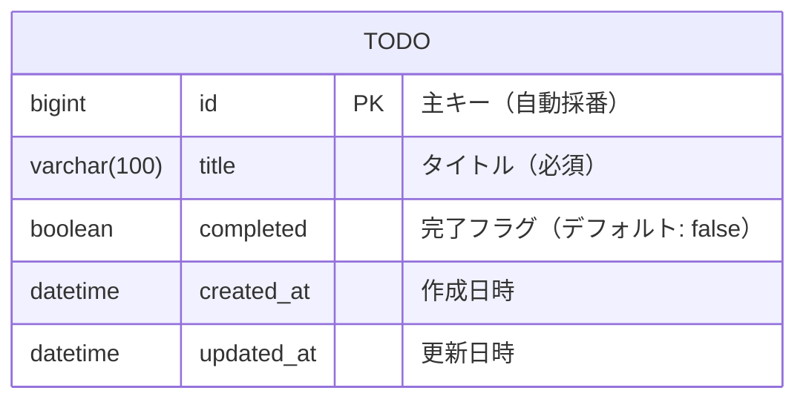
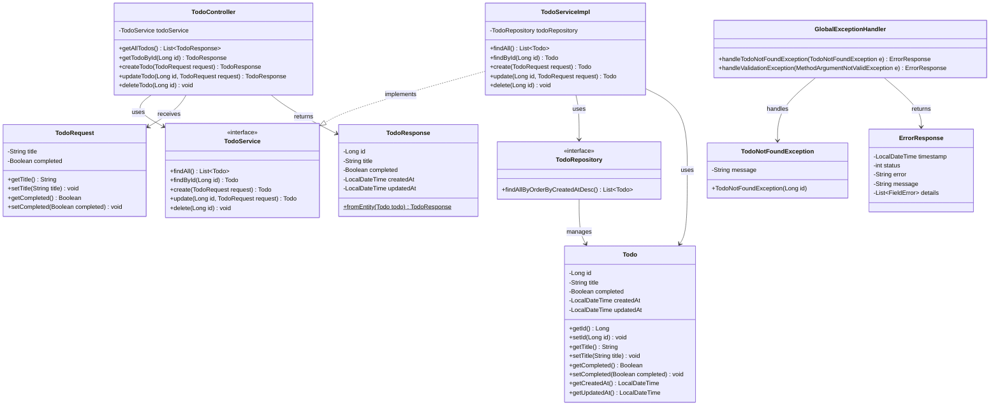
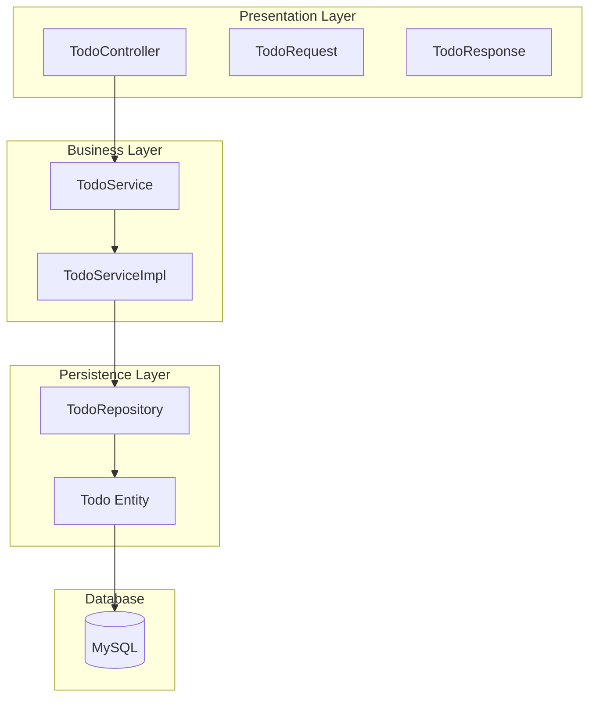
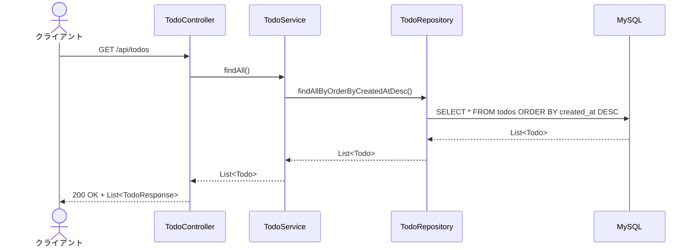
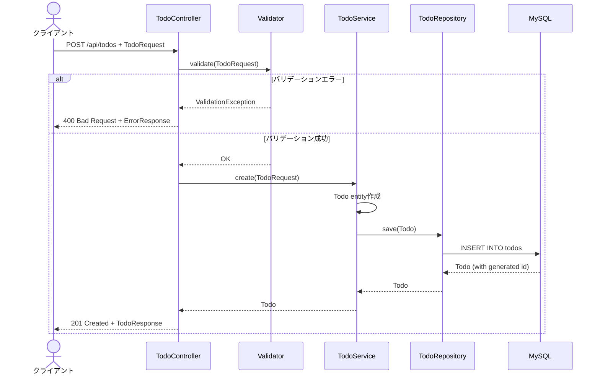
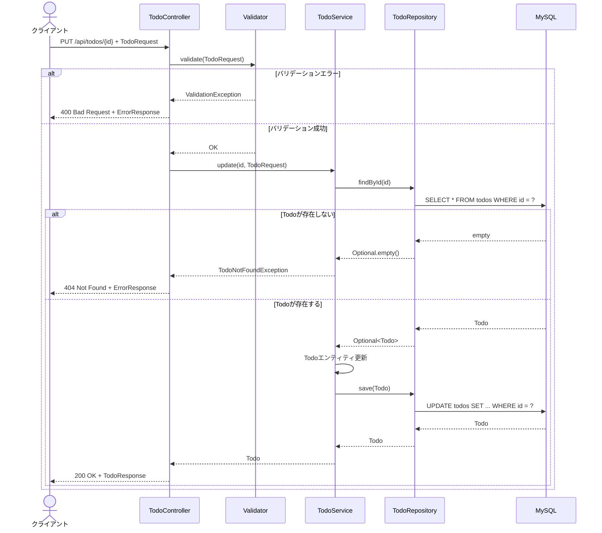
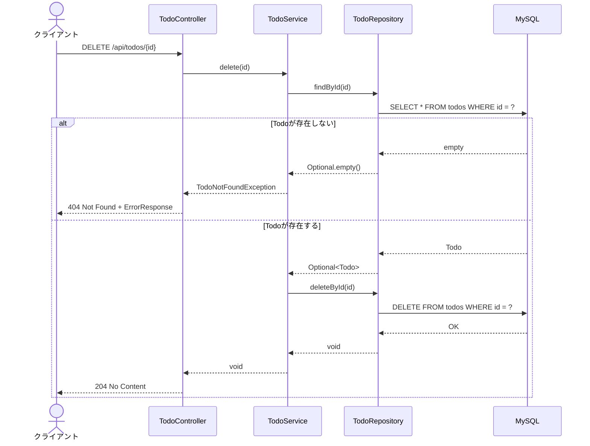
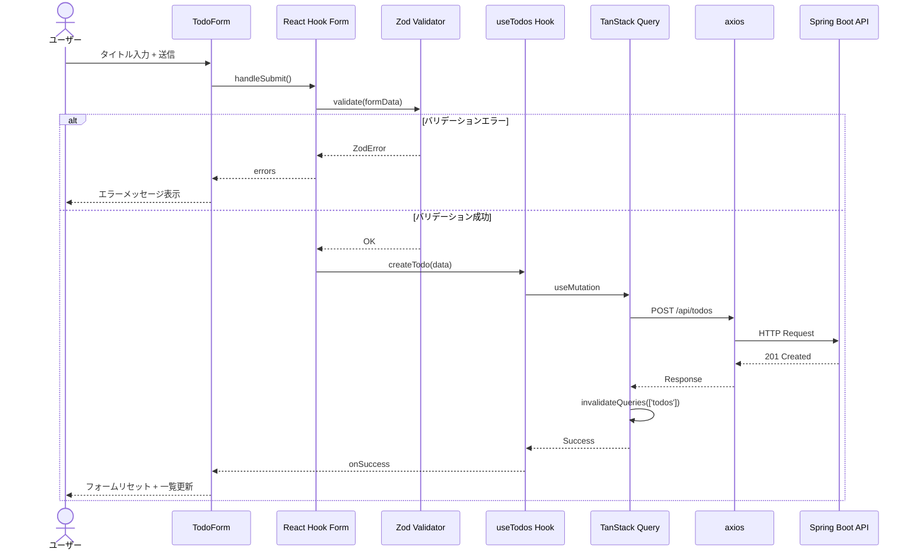

# Todo アプリ設計書

## 概要

本ドキュメントは、Spring Boot + Next.js を使用した Todo アプリケーションの設計資料です。
AI駆動開発を前提とした学習課題として使用します。

### 技術スタック

#### バックエンド
| 項目 | バージョン/選択 |
|------|----------------|
| Java | 25 |
| Spring Boot | 4.0 |
| ビルドツール | Gradle |
| DB | MySQL |
| ORM | Spring Data JPA |

#### フロントエンド
| 項目 | バージョン/選択 |
|------|----------------|
| Next.js | 16 |
| ルーティング | App Router |
| UIライブラリ | Tailwind CSS + shadcn/ui |
| API通信 | axios + TanStack Query |
| フォーム/バリデーション | React Hook Form + zod |

### 参考ドキュメント

- [Spring Boot 公式ドキュメント](https://docs.spring.io/spring-boot/docs/current/reference/html/)
- [Next.js 公式ドキュメント](https://nextjs.org/docs)
- [shadcn/ui 公式](https://ui.shadcn.com/)
- [TanStack Query 公式](https://tanstack.com/query/latest)
- [React Hook Form 公式](https://react-hook-form.com/)
- [Zod 公式](https://zod.dev/)

---

## 1. 機能一覧

### 1.1 機能概要

| 機能ID | 機能名 | 説明 |
|--------|--------|------|
| F-001 | Todo一覧表示 | 登録されているTodoを一覧で表示する |
| F-002 | Todo新規作成 | 新しいTodoを作成する |
| F-003 | Todo更新 | 既存のTodoのタイトル・完了状態を更新する |
| F-004 | Todo削除 | 既存のTodoを削除する |

### 1.2 機能詳細

#### F-001: Todo一覧表示
- 全てのTodoを作成日時の降順で表示
- 各Todoのタイトル、完了状態、作成日時を表示
- 完了/未完了でフィルタリング（オプション）

#### F-002: Todo新規作成
- タイトルを入力して新規Todoを作成
- バリデーション：タイトルは必須、1〜100文字
- 作成時は未完了状態で登録

#### F-003: Todo更新
- タイトルの編集
- 完了状態のトグル（チェックボックス）
- バリデーション：タイトルは必須、1〜100文字

#### F-004: Todo削除
- 確認ダイアログ表示後に削除
- 削除後は一覧を再取得

---

## 2. API仕様書

### 2.1 エンドポイント一覧

| メソッド | エンドポイント | 説明 |
|----------|---------------|------|
| GET | `/api/todos` | Todo一覧取得 |
| GET | `/api/todos/{id}` | Todo詳細取得 |
| POST | `/api/todos` | Todo新規作成 |
| PUT | `/api/todos/{id}` | Todo更新 |
| DELETE | `/api/todos/{id}` | Todo削除 |

### 2.2 共通仕様

#### ベースURL
```
http://localhost:8080
```

#### 共通レスポンスヘッダー
```
Content-Type: application/json
```

#### エラーレスポンス形式
```json
{
  "timestamp": "2025-01-15T10:30:00",
  "status": 400,
  "error": "Bad Request",
  "message": "バリデーションエラー",
  "details": [
    {
      "field": "title",
      "message": "タイトルは必須です"
    }
  ]
}
```

### 2.3 API詳細

#### GET /api/todos - Todo一覧取得

**リクエスト**
```
GET /api/todos
```

**レスポンス（200 OK）**
```json
[
  {
    "id": 1,
    "title": "買い物に行く",
    "completed": false,
    "createdAt": "2025-01-15T10:00:00",
    "updatedAt": "2025-01-15T10:00:00"
  },
  {
    "id": 2,
    "title": "レポートを書く",
    "completed": true,
    "createdAt": "2025-01-14T09:00:00",
    "updatedAt": "2025-01-15T08:00:00"
  }
]
```

---

#### GET /api/todos/{id} - Todo詳細取得

**リクエスト**
```
GET /api/todos/1
```

**レスポンス（200 OK）**
```json
{
  "id": 1,
  "title": "買い物に行く",
  "completed": false,
  "createdAt": "2025-01-15T10:00:00",
  "updatedAt": "2025-01-15T10:00:00"
}
```

**レスポンス（404 Not Found）**
```json
{
  "timestamp": "2025-01-15T10:30:00",
  "status": 404,
  "error": "Not Found",
  "message": "指定されたTodoが見つかりません"
}
```

---

#### POST /api/todos - Todo新規作成

**リクエスト**
```
POST /api/todos
Content-Type: application/json

{
  "title": "新しいタスク"
}
```

**リクエストボディ**
| フィールド | 型 | 必須 | バリデーション |
|-----------|-----|------|---------------|
| title | string | ○ | 1〜100文字 |

**レスポンス（201 Created）**
```json
{
  "id": 3,
  "title": "新しいタスク",
  "completed": false,
  "createdAt": "2025-01-15T11:00:00",
  "updatedAt": "2025-01-15T11:00:00"
}
```

**レスポンス（400 Bad Request）**
```json
{
  "timestamp": "2025-01-15T10:30:00",
  "status": 400,
  "error": "Bad Request",
  "message": "バリデーションエラー",
  "details": [
    {
      "field": "title",
      "message": "タイトルは1〜100文字で入力してください"
    }
  ]
}
```

---

#### PUT /api/todos/{id} - Todo更新

**リクエスト**
```
PUT /api/todos/1
Content-Type: application/json

{
  "title": "買い物に行く（更新）",
  "completed": true
}
```

**リクエストボディ**
| フィールド | 型 | 必須 | バリデーション |
|-----------|-----|------|---------------|
| title | string | ○ | 1〜100文字 |
| completed | boolean | ○ | - |

**レスポンス（200 OK）**
```json
{
  "id": 1,
  "title": "買い物に行く（更新）",
  "completed": true,
  "createdAt": "2025-01-15T10:00:00",
  "updatedAt": "2025-01-15T12:00:00"
}
```

**レスポンス（404 Not Found）**
```json
{
  "timestamp": "2025-01-15T10:30:00",
  "status": 404,
  "error": "Not Found",
  "message": "指定されたTodoが見つかりません"
}
```

---

#### DELETE /api/todos/{id} - Todo削除

**リクエスト**
```
DELETE /api/todos/1
```

**レスポンス（204 No Content）**
```
（空レスポンス）
```

**レスポンス（404 Not Found）**
```json
{
  "timestamp": "2025-01-15T10:30:00",
  "status": 404,
  "error": "Not Found",
  "message": "指定されたTodoが見つかりません"
}
```

---

## 3. ER図



### テーブル定義

#### todosテーブル

| カラム名 | 型 | 制約 | 説明 |
|---------|-----|------|------|
| id | BIGINT | PRIMARY KEY, AUTO_INCREMENT | 主キー |
| title | VARCHAR(100) | NOT NULL | タイトル |
| completed | BOOLEAN | NOT NULL, DEFAULT FALSE | 完了フラグ |
| created_at | DATETIME | NOT NULL | 作成日時 |
| updated_at | DATETIME | NOT NULL | 更新日時 |

#### DDL

```sql
CREATE TABLE todos (
    id BIGINT AUTO_INCREMENT PRIMARY KEY,
    title VARCHAR(100) NOT NULL,
    completed BOOLEAN NOT NULL DEFAULT FALSE,
    created_at DATETIME NOT NULL,
    updated_at DATETIME NOT NULL
);
```

---

## 4. パッケージ構成図

### 4.1 バックエンド（Spring Boot）

```
todo-api/
├── build.gradle
├── settings.gradle
├── src/
│   ├── main/
│   │   ├── java/
│   │   │   └── com/
│   │   │       └── example/
│   │   │           └── todo/
│   │   │               ├── TodoApplication.java
│   │   │               ├── controller/
│   │   │               │   └── TodoController.java
│   │   │               ├── service/
│   │   │               │   ├── TodoService.java
│   │   │               │   └── impl/
│   │   │               │       └── TodoServiceImpl.java
│   │   │               ├── repository/
│   │   │               │   └── TodoRepository.java
│   │   │               ├── entity/
│   │   │               │   └── Todo.java
│   │   │               ├── dto/
│   │   │               │   ├── TodoRequest.java
│   │   │               │   └── TodoResponse.java
│   │   │               └── exception/
│   │   │                   ├── GlobalExceptionHandler.java
│   │   │                   ├── TodoNotFoundException.java
│   │   │                   └── ErrorResponse.java
│   │   └── resources/
│   │       └── application.yml
│   └── test/
│       └── java/
│           └── com/
│               └── example/
│                   └── todo/
│                       ├── controller/
│                       │   └── TodoControllerTest.java
│                       └── service/
│                           └── TodoServiceTest.java
└── docker-compose.yml
```

### 4.2 フロントエンド（Next.js）

```
todo-frontend/
├── package.json
├── next.config.js
├── tailwind.config.js
├── tsconfig.json
├── components.json
├── src/
│   ├── app/
│   │   ├── layout.tsx
│   │   ├── page.tsx
│   │   └── globals.css
│   ├── components/
│   │   ├── ui/                      # shadcn/ui コンポーネント
│   │   │   ├── button.tsx
│   │   │   ├── input.tsx
│   │   │   ├── checkbox.tsx
│   │   │   ├── card.tsx
│   │   │   ├── dialog.tsx
│   │   │   └── form.tsx
│   │   └── todo/
│   │       ├── TodoList.tsx
│   │       ├── TodoItem.tsx
│   │       ├── TodoForm.tsx
│   │       └── TodoEditDialog.tsx
│   ├── hooks/
│   │   └── useTodos.ts              # TanStack Query hooks
│   ├── lib/
│   │   ├── api.ts                   # axios インスタンス
│   │   └── utils.ts                 # shadcn/ui ユーティリティ
│   ├── schemas/
│   │   └── todo.ts                  # zod スキーマ
│   └── types/
│       └── todo.ts                  # 型定義
└── public/
```

---

## 5. クラス図

### 5.1 バックエンド クラス図



### 5.2 レイヤー構成図



---

## 6. シーケンス図

### 6.1 Todo一覧取得（GET /api/todos）



### 6.2 Todo新規作成（POST /api/todos）



### 6.3 Todo更新（PUT /api/todos/{id}）



### 6.4 Todo削除（DELETE /api/todos/{id}）



### 6.5 フロントエンド フロー（Todo作成例）



---

## 7. 開発環境セットアップ

### 7.1 バックエンド

```bash
# プロジェクト作成（Spring Initializr使用）
# https://start.spring.io/ で以下を選択:
# - Project: Gradle - Groovy
# - Language: Java
# - Spring Boot: 4.0.x
# - Java: 25
# - Dependencies: Spring Web, Spring Data JPA, MySQL Driver, Validation

# MySQL起動（Docker使用）
docker-compose up -d

# アプリケーション起動
./gradlew bootRun
```

### 7.2 フロントエンド

```bash
# プロジェクト作成
npx create-next-app@latest todo-frontend --typescript --tailwind --eslint --app

# shadcn/ui セットアップ
npx shadcn@latest init

# 必要なshadcn/uiコンポーネント追加
npx shadcn@latest add button input checkbox card dialog form

# 依存関係インストール
npm install axios @tanstack/react-query react-hook-form @hookform/resolvers zod

# 開発サーバー起動
npm run dev
```

### 7.3 docker-compose.yml（MySQL用）

```yaml
version: '3.8'

services:
  mysql:
    image: mysql:8.0
    container_name: todo-mysql
    environment:
      MYSQL_ROOT_PASSWORD: root
      MYSQL_DATABASE: todo_db
      MYSQL_USER: todo_user
      MYSQL_PASSWORD: todo_password
    ports:
      - "3306:3306"
    volumes:
      - mysql_data:/var/lib/mysql

volumes:
  mysql_data:
```

### 7.4 application.yml（Spring Boot）

```yaml
spring:
  datasource:
    url: jdbc:mysql://localhost:3306/todo_db
    username: todo_user
    password: todo_password
    driver-class-name: com.mysql.cj.jdbc.Driver
  jpa:
    hibernate:
      ddl-auto: update
    show-sql: true
    properties:
      hibernate:
        format_sql: true

server:
  port: 8080
```

---

## 8. 学習のポイント

### バックエンド（Spring Boot）

1. **レイヤードアーキテクチャの理解**
   - Controller: HTTPリクエスト/レスポンスの処理
   - Service: ビジネスロジック
   - Repository: データアクセス
   - Entity: データベースとのマッピング

2. **Spring Data JPAの基本**
   - `JpaRepository`の継承
   - クエリメソッドの命名規則

3. **RESTful API設計**
   - 適切なHTTPメソッドの使い分け
   - ステータスコードの使い方

4. **例外ハンドリング**
   - `@ControllerAdvice`による共通エラー処理

### フロントエンド（Next.js）

1. **App Routerの基本**
   - ファイルベースルーティング
   - Server ComponentとClient Component

2. **状態管理（TanStack Query）**
   - `useQuery`によるデータ取得
   - `useMutation`による更新処理
   - キャッシュの無効化

3. **フォーム処理（React Hook Form + Zod）**
   - スキーマベースのバリデーション
   - エラーハンドリング

4. **UIコンポーネント（shadcn/ui）**
   - コンポーネントの利用方法
   - カスタマイズ

---

## 9. 発展課題（オプション）

基本課題完了後、以下に挑戦することを推奨します：

1. **フィルタリング機能**: 完了/未完了でフィルタ
2. **ソート機能**: 作成日時、タイトルでソート
3. **検索機能**: タイトルで検索
4. **ページネーション**: 大量データ対応
5. **認証機能**: Spring Security + JWT

